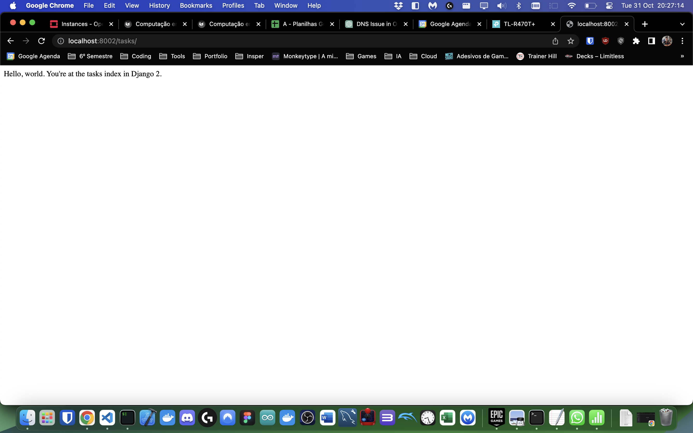
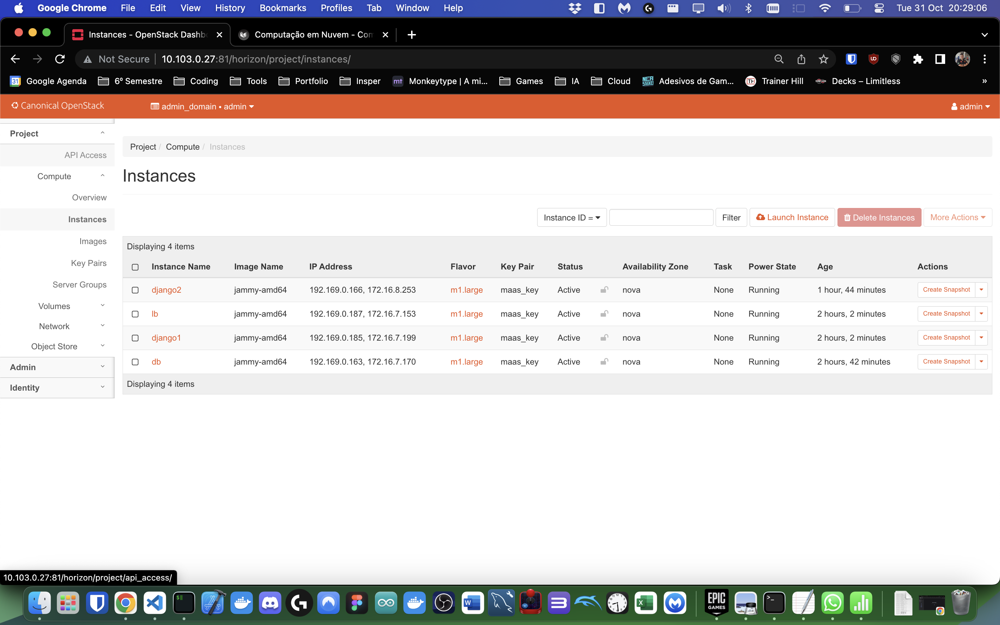
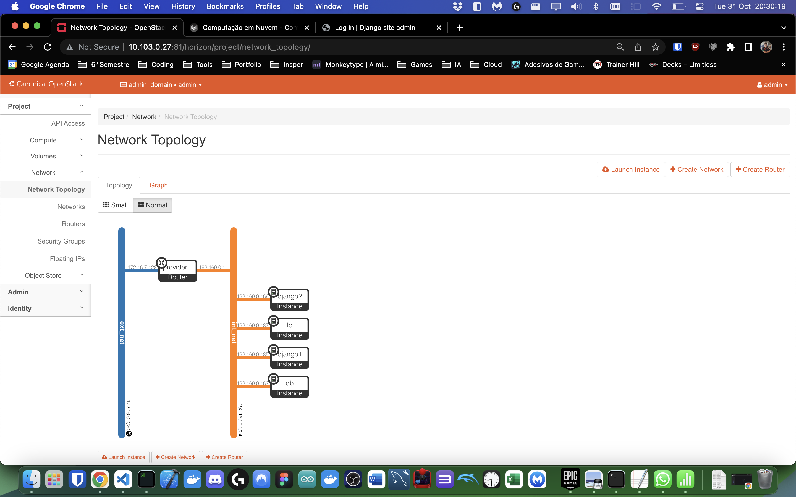
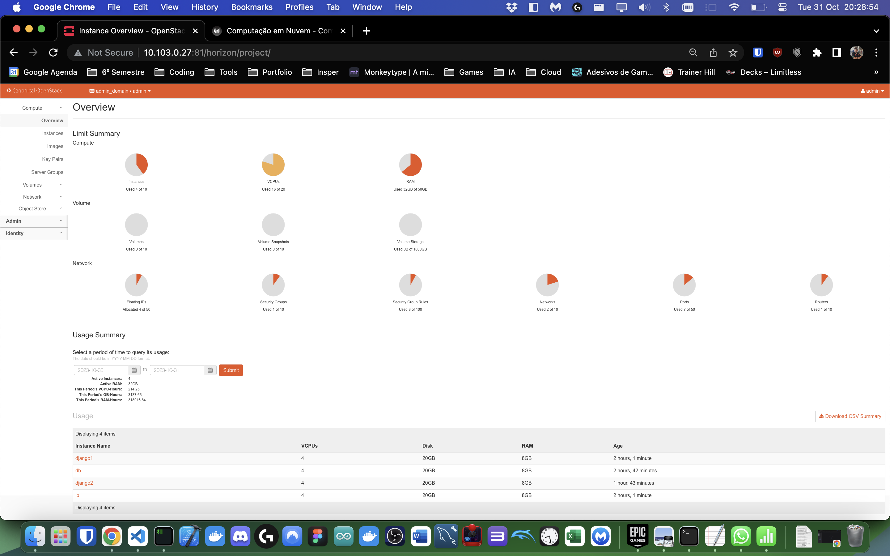

# Uso da Infraestrutura

Objetivos

1. Aprender a utilizar a nuvem Openstack para aplicações mundo real;
2. Aprofundar conceitos sobre deploy de aplicações em nuvem.

Pré-requisitos:

1. Terminar o roteiro anterior (OpenStack).

## Django na Nuvem VM criada

Agora que conseguimos corrigir o erro apontado na conclusão do H2, vamos levantar a mesma aplicação Django mas sem precisar sacrificar 4 máquinas inteiras.

### Criando as instâncias necessárias

Vamos começar criando as duas instâncias de Django. Para isso, rode os comandos abaixo:

```bash
openstack server create --image jammy-amd64 --flavor m1.large \
   --key-name maas_key --network int_net \
    django1
```

```bash
openstack server create --image jammy-amd64 --flavor m1.large \
   --key-name maas_key --network int_net \
    django2
```

Em seguida, criamos a instância de banco de dados:

```bash
openstack server create --image jammy-amd64 --flavor m1.large \
   --key-name maas_key --network int_net \
    db
```

Por fim, criamos a instância de balanceador de carga:

```bash
openstack server create --image jammy-amd64 --flavor m1.large \
   --key-name maas_key --network int_net \
    lb
```

### Assinalando os IPs flutuantes

Agora, vamos assinalar os IPs flutuantes para cada uma das instâncias:

```bash
IP_DJANGO1=$(openstack floating ip create -f value -c floating_ip_address ext_net)
openstack server add floating ip django1 $IP_DJANGO1
```

```bash
IP_DJANGO2=$(openstack floating ip create -f value -c floating_ip_address ext_net)
openstack server add floating ip django2 $IP_DJANGO2
```

```bash
IP_DB=$(openstack floating ip create -f value -c floating_ip_address ext_net)
openstack server add floating ip db $IP_DB
```

```bash
IP_LB=$(openstack floating ip create -f value -c floating_ip_address ext_net)
openstack server add floating ip lb $IP_LB
```

### Configurando PostgreSQL (banco de dados)

Vamos acessar a instância de banco de dados:

```bash
ssh ubuntu@$IP_DB
```

Começamos assinalando o IP do nameserver no arquivo do netplan:

```bash
sudo nano /etc/netplan/50-cloud-init.yaml
```

E adicionamos o seguinte ao final do arquivo:

```txt
    nameservers:
        addresses: 172.16.0.1
```

Instalando o PostgreSQL:

```bash
sudo apt update
sudo apt install postgresql postgresql-contrib -y
```

Agora, vamos criar o banco de dados e o usuário:

```bash
sudo su - postgres
createuser -s cloud -W
```

Configure a senha **cloud**. Crie a database para o projeto Django:

```bash
createdb -O cloud tasks
```

Exponha o banco de dados para acesso externo:

```bash
nano /etc/postgresql/14/main/postgresql.conf
```

E dentro do arquivo, altere a linha:

```txt
    listen_addresses = '*'
```

Altere também o arquivo de configuração de autenticação:

```bash
nano /etc/postgresql/14/main/pg_hba.conf
```

E adicione a seguinte linha:

```txt
  host    all             all             172.16.0.0/20          trust
```

Saia do usuário postgres:

```bash
exit
```

Libere o firewall:

```bash
sudo ufw allow 5432/tcp
```

Por fim, reinicie o PostgreSQL:

```bash
sudo systemctl restart postgresql
```

### Configurando Django

Vamos acessar a instância de Django 1:

```bash
ssh ubuntu@$IP_DJANGO1
```

Clonamos o repositório e instalamos:

```bash
git clone https://github.com/raulikeda/tasks.git
cd tasks
sudo apt update
sudo apt install python3
```

Alteramos a linha do `views.py`:

```bash
sudo nano tasks/views.py
```

E alteramos a linha:

```python
    return HttpResponse("Hello, world. You're at the tasks index in Django 1.")
```

Adicionamos o `server1` ao arquivo de hosts:

```bash
sudo nano /etc/hosts
```

E adicionamos a seguinte linha:

```txt
<IP_DB> server1
```

Instalamos conteúdo do arquivo `./install.sh`:

```bash
./install.sh
```

Rebootamos a instância:

```bash
sudo reboot
```

Vamos testar se a aplicação está funcionando:

```bash
wget http://[IP]:8080/admin/
```

Para o Django2, resolvemos utilizar o Ansible para automatizar a instalação. Para isso rodamos os segundos comandos:

```bash
git clone https://github.com/raulikeda/tasks.git
cd tasks
``````

Alteramos a linha do `views.py`:

```bash
sudo nano tasks/views.py
```

E alteramos a linha:

```python
    return HttpResponse("Hello, world. You're at the tasks index in Django 2.")
```

E rodamos o Ansible:

```bash
ansible-playbook tasks-install-playbook.yaml --extra-vars server=<IP_DJANGO2>
```

E testamos se a aplicação está funcionando:

```bash
ssh ubuntu@$IP_DJANGO2
wget http://[IP]:8080/admin/
```

### Configurando Nginx (load balancer)

Vamos acessar a instância de balanceador de carga:

```bash
ssh ubuntu@$IP_LB
```

Instalando o Nginx:

```bash
sudo apt update
sudo apt install nginx
```

Abra o arquivo de configuração do Nginx:

```bash
sudo nano /etc/nginx/sites-available/default
```

E adicione o seguinte:

```txt
server { location / { proxy_pass http://backend; } }
upstream backend { server <IP_DJANGO1>:8080; server <IP_DJANGO2>:8080; }
```

Reinicie o Nginx:

```bash
sudo service nginx restart
```

### Testando a aplicação

Por fim, vamos testar a aplicação. Para isso, fazemos o port forward do load balancer:

```bash
ssh cloud@roteador -L 8002:[IP_LB]:80
```

E, por fim, acessamos o endereço `http://localhost:8002/tasks/` no navegador.

## Fotos comprovantes do trabalho






