# Roteiro 2 - Plataforma de Segurança

Integrantes: Antonio Amaral, Ariel Leventhal, Enricco Gemha

## Perguntas

### 1. O que é e quais são as características de um SIEM?

O gerenciamento de informações e eventos de segurança, ou SIEM, é uma solução de segurança que ajuda as organizações a reconhecer e abordar possíveis ameaças e vulnerabilidades de segurança antes que elas tenham a chance de interromper as operações comerciais. SIEMs podem ser instalados on-premise (na própria infraestrutura da empresa) ou na nuvem.

Algumas características de um SIEM são:

- Coleta de dados: Recebe logs de dispositivos, aplicativos, sistemas e outras fontes de segurança.
- Normalização: Padroniza os dados coletados para facilitar a análise.
- Armazenamento: Armazena os dados coletados para análise histórica e forense.
- Análise: Identifica e correlaciona eventos de segurança para detectar ameaças.
- Alerta: Notifica sobre eventos de segurança que podem ser potenciais ameaças.
- Investigação: Fornece ferramentas para investigar e responder a incidentes de segurança.
- Relatórios: Gera relatórios sobre a atividade de segurança da organização.

### 2. Em que situações o grupo instalaria um SIEM?

Existem algumas razões pelas quais poderia-se instalar um SIEM como, por exemplo, atender a regulamentações ou questões de compliance internos, ou talvez melhorar o tempo de resposta a incidentes, para assegurar um uptime "ótimo" da aplicação. Também existe a possibilidade de ser instalado para ter uma visão unificada dos eventos ocorrendo simultaneamente nos sistemas de segurança da empresa, ajudando a detectar ameaças de forma mais eficaz.

### 3. Qual a diferença de um SIEM para um Gerenciador de LOG (SYSLOG)?

O Gerenciador de LOG (SYSLOG) realiza a coleta dos logs e fornece ferramentas para pesquisa e análise deles, porém não tem a capacidade de correlacionar eventos para detectar ameaças. Ou seja, ele é uma forma sofisticada de centralizar os logs de vários sistemas diferentes.

Por outro lado, o SIEM possui as mesmas funcionalidades que um gerenciador de log, mas não se limita somente a elas, já que ele obtém informações também de outros serviços, como software antivírus, sistemas de detecção de intrusão e bancos de dados. Ele também é capaz de correlacionar eventos de segurança para detectar ameaças, provendo ferramentas de resposta a incidentes de segurança.

### 4. O que é o OSSEC?

OSSEC (Sistema de Detecção de Intrusão baseado em Host de código aberto) é uma plataforma de código aberto completa para monitorar e controlar uma ou múltiplos sistemas. Ele combina todos os aspectos de HIDS (detecção de intrusão baseada em host), monitoramento de log e SIEM em uma solução só. Ele performa, por exemplo, análise de logs, checagem de integridade de arquivos, monitoramento de policies, detecção de rootkit, alertas em tempo real e resposta a incidentes.

### 5. Qual a função do Kibana no Wazuh?

Kibana faz parte da ELK Stack (Elasticsearch, Logstash e Kibana), a qual pode ser facilmente integrada com o Wazuh para armazenamento, análise e visualização de dados de segurança. Isso permite criar dashboards personalizados e executar análises avançadas sobre os eventos de segurança coletados pelo Wazuh.

## Configurando a infraestrutura

### Considerações extras

Durante uma atividade recente, foi identificado a necessidade de atualizar a máquina do Guacamole para uma instância t2.large. Essa atualização oferece recursos computacionais e memória RAM adicionais em comparação com a configuração anterior. Após discussão e aprovação do Professor Rodolfo Avelino, foram realizadas a mudança de instância. A decisão foi motivada pelo fato de que as instâncias t2.micro e t2.medium não estavam suportando o acesso SSH de todos os membros do grupo por meio do Guacamole.

Anteriormente, era enfrentado problemas nos quais a instância do Guacamole alcançava 100% de utilização de CPU, resultando em travamentos.

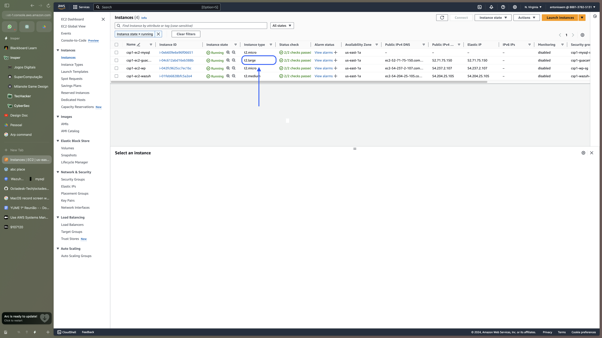

### Configuração Guacamole

O guacamole foi configurado com necessidade de autenticação de dois fatores atraves de TOTP:

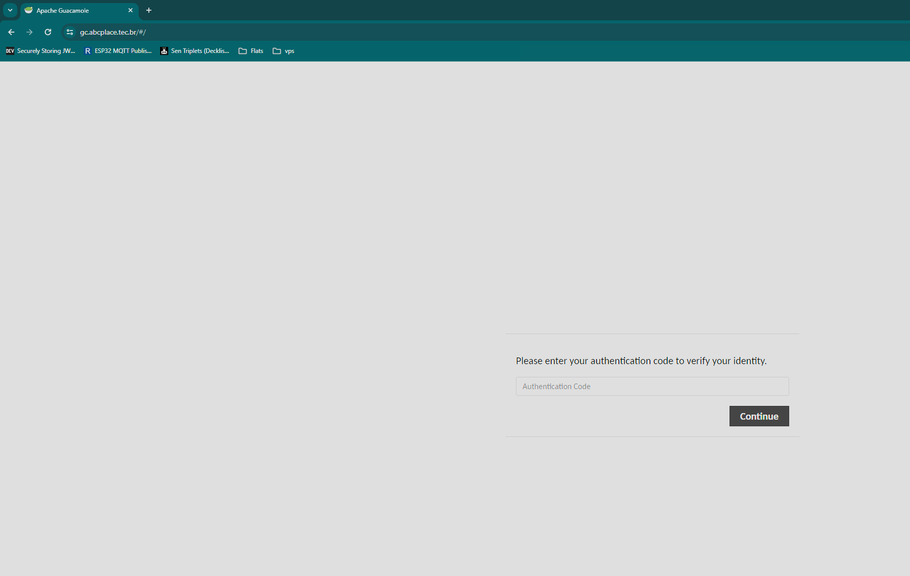

As conexões com as instancias foram seperadas em dois grupos:

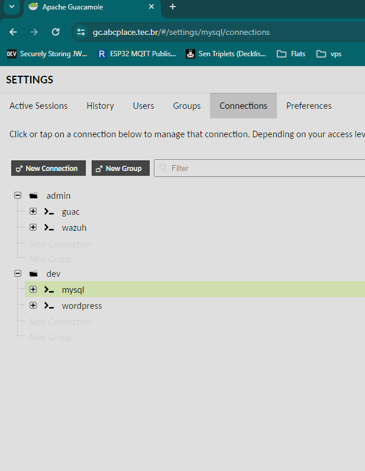

Também foram criados dois grupos de usuários:

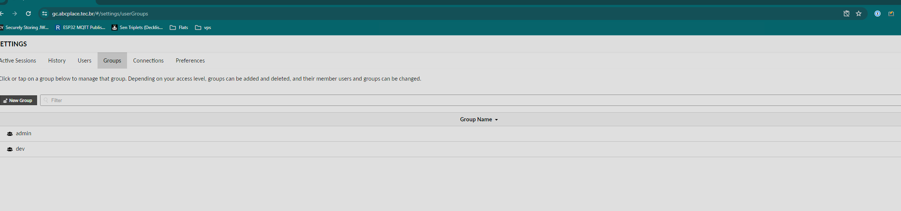

Entao os usuários e grupos de conexões foram adicionados aos grupos de usuários:

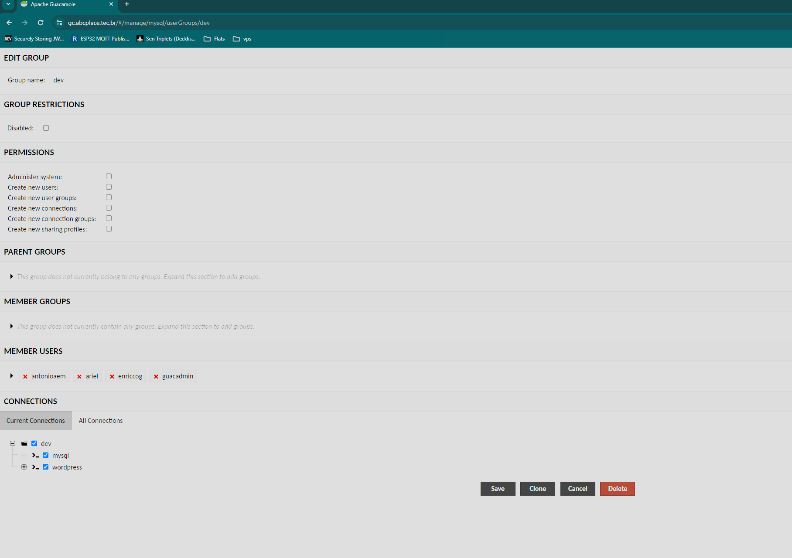

### Subindo o serviço Wazuh

Conforme solicitado no roteiro, configurou-se o serviço Wazuh em um instância EC2 da AWS, com um Elastic IP associado. Por sua vez, com posse deste IP, criou-se o subdomínio para o Wazuh, [wazuh.abcplace.tec.br](https://wazuh.abcplace.tec.br/), que possui certificado SSL para garantir seu acesso via HTTPS. Para a instalação do Wazuh seguiu-se a documentação disponível no [site oficial](https://documentation.wazuh.com/current/index.html).

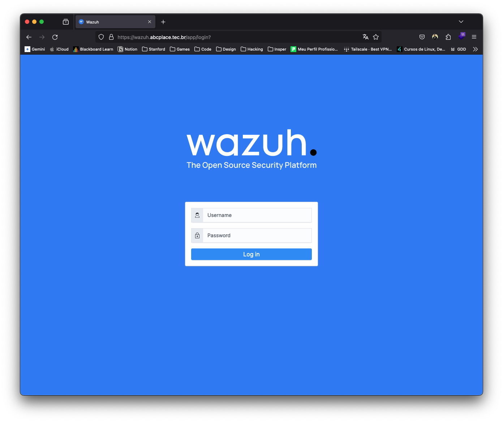

### Configurando os agents Wazuh

Para se obter os dados que alimentam o Wazuh, instalou-se agentes em todas as instâncias desejadas, utilizando o seguinte comando:

```bash
wget https://packages.wazuh.com/4.x/apt/pool/main/w/wazuh-agent/wazuh-agent_4.7.3-1_amd64.deb && sudo WAZUH_MANAGER='192.0.0.1' dpkg -i ./wazuh-agent_4.7.3-1_amd64.deb
```

Realizando as modificações necessárias para ajustar o IP do Wazuh Manager, substituindo o IP por `172.31.0.142`. Após a instalação dos pacotes necessários, foi necessário reiniciar o serviço do agente Wazuh.

```bash
sudo systemctl daemon-reload
sudo systemctl enable wazuh-agent
sudo systemctl start wazuh-agent
```

Este processo foi realizado em todas as instâncias. Para garantir o funcionamento, foram utilizados os seguintes comandos para acesso do ossec e visualização de logs:

```bash
 sudo nano /var/ossec/etc/ossec.conf
``````bash
sudo tail -f /var/ossec/logs/ossec.log
```

Utilizando o dashboard do Wazuh é pode-se visualizar todos os agentes, ou seja, WordPress-BF-Agent, MySQL-BF-Agent e JMP-BF-Agent, sendo BF uma abreviação para Brute Forcing.

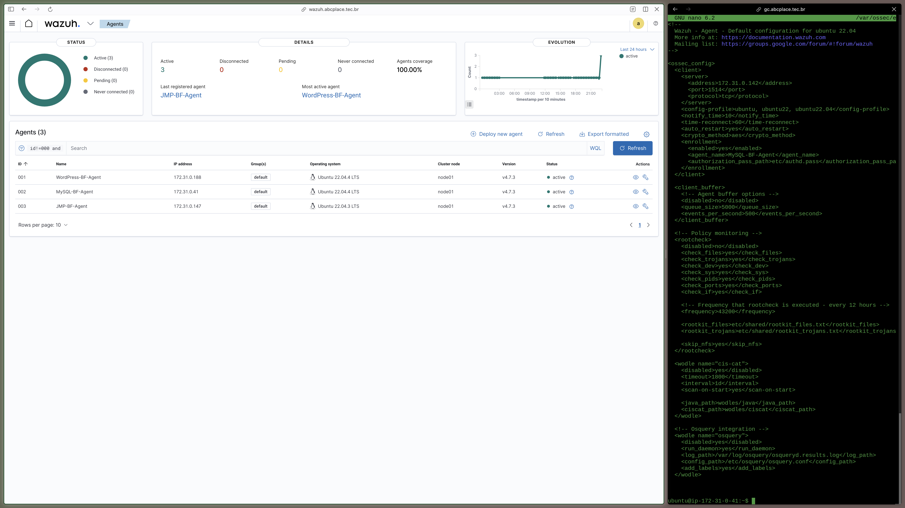

### Capturando ocorrências de Brute Forcing SSH

O próximo passo tomado foi configurar o Wazuh para detectar tentativas de brute forcing ssh nos servidores da aplicação ABC Place.

Após completar a configuração, o Wazuh capturou uma ocorrência no dia 10 de abril de 2024 às 23:30:17.497, do tipo brute forcing através de SSH, sem uso de um usuário existente.

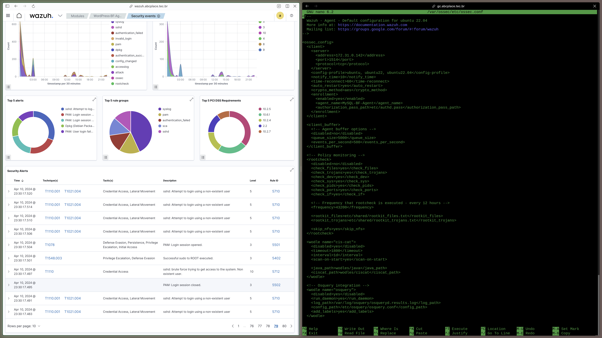

### Gerenciando o acesso às instâncias (SGs)

Todas as instâncias EC2 estão configuradas com um Security Group exclusivo e associado a elas. Nele, foi bloqueado qualquer acesso de rede externa a da VPC que não seja nas portas 80, 443, para os serviços que a necessitam, como WordPress, Guacamole e Wazuh.

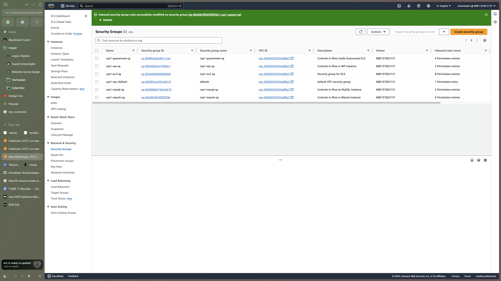

- Instância MySQL: não possui acesso externo à VPC, e pode somente ser acessado internamente pela porta 3306.

  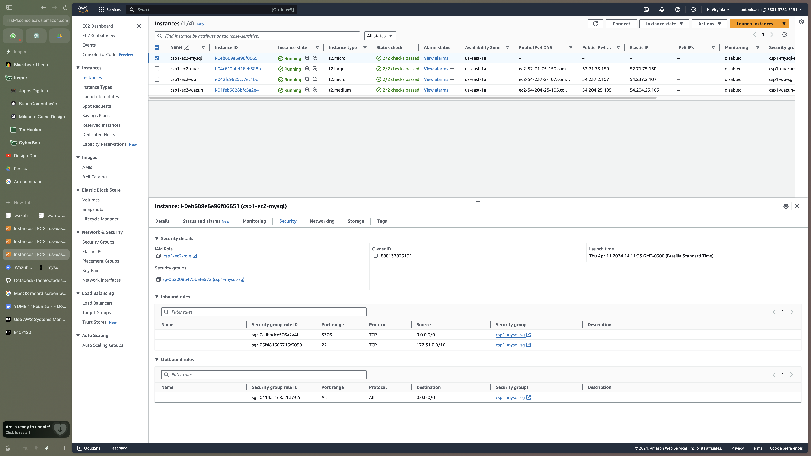

- Instância WordPress: O acesso às portas 80 e 443 estão liberados ao público, e a porta 22 está liberada somente para acesso de SSH privado, bloco CIDR da rede interna (172.31.0.0/16), utilizado pelo serviço Guacamole.

  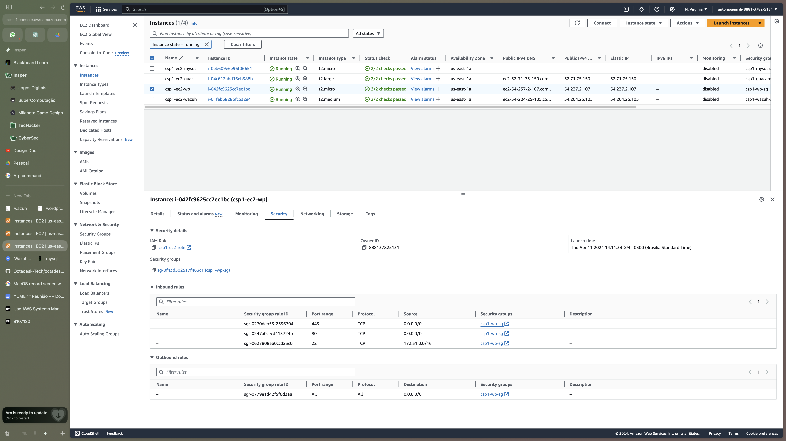

- Instância Guacamole: Possui acesso liberado nas portas 80, 443, respectivamente, HTTP e HTTPS, e conexão SSH via porta 22, porém este somente para o bloco CIDR da rede interna (172.31.0.0/16).

  

- Instância Wazuh: Libera-se o acesso público via HTTP (80) e HTTPS (443), bem como libera-se o acesso interno para as conexões com os agentes instalados nas outras instâncias, porém este somente para o bloco CIDR da rede interna (172.31.0.0/16), através das portas 1514 e 1515, utilizadas pelo Wazuh. Por fim, liberou-se o acesso SSH (22) para instâncias dentro da VPC, utilizado pelo serviço Guacamole.

  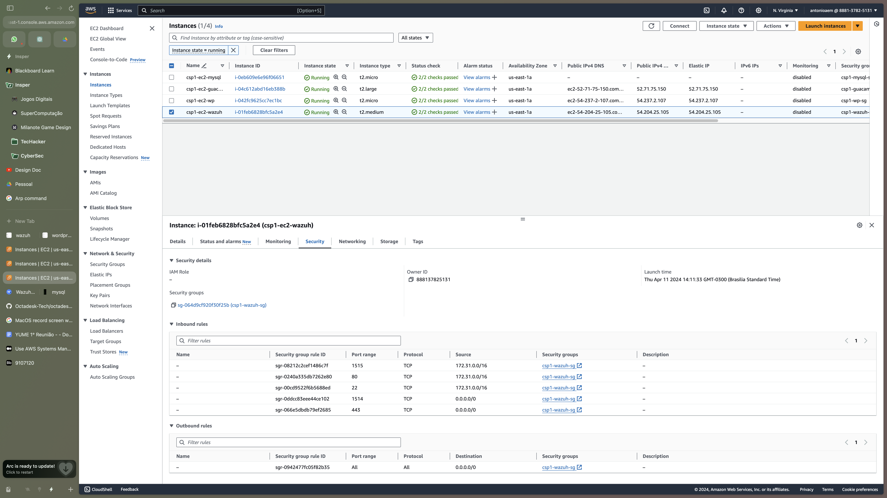

### Envio de alertas por e-mail

De acordo com o roteiro o próximo passo é a configuração de alertas via email. Para isso há a necessidade de se configurar um servidor SMTP Host para envio de e-mails. Para simplificar foi utilizado o serviço de SMTP da A2C Solutions, Software House dos integrantes Antônio Martins e Ariel Leventhal.

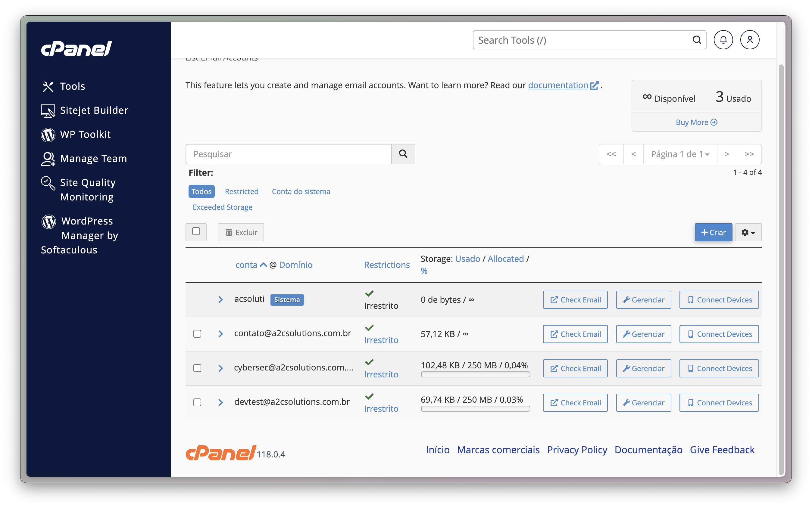

Sendo assim o email utilizado para este roteiro é o `cybersec@a2csolutions.com.br`.

No restante foi utilizada a documentação do Wazuh para realizar a instalação do postfix, que possibilitou o uso do servidor SMTP `mail.a2csolutions.com.br` uma vez que o serviço necessita de autenticação.

Configurou-se também o envio de alertas por e-mail, via SMTP, utilizando o comando a seguir:

```sh
echo "This is the email body." | mail -s "Email subject" -a "From: cybersec@a2csolutions.com.br" antonioaem@icloud.com
```

Obtendo-se o seguinte e-mail:

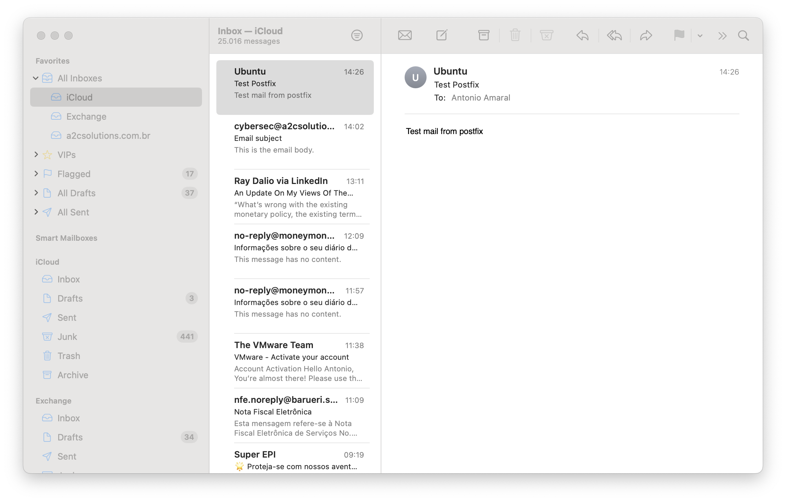

Com isso, o Wazuh foi configurado para enviar e-mails com alertas de nível 2, como uma forma prática de testar se o funcionamento. Sendo assim, seriam enviados alertas básicos de login e autenticação para ser possível testar o envio via Wazuh.

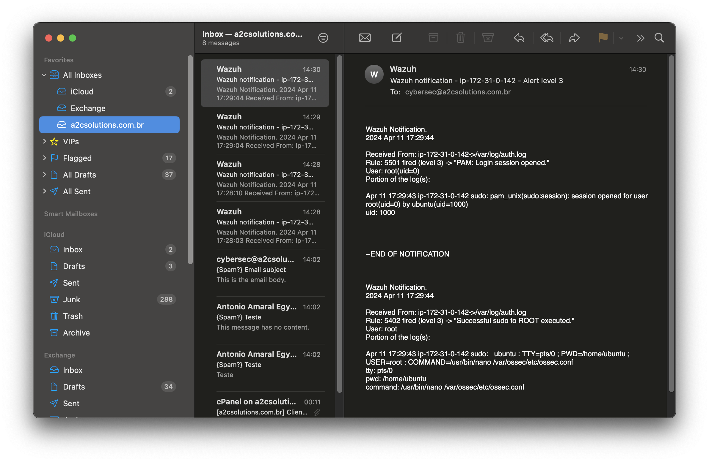

Vale ressaltar que atualmente, ele se encontra configurado para alertas de nível 12.

### Configurando os logs de CloudWatch

Quanto aos logs de CloudWatch, teoricamente consegui-se configurá-los, e conseguiu-se estabelecer a autenticação com o bucket S3 e, por conseguinte, as boas práticas de IAM, que consistem na criação de um usuário de serviço exclusivo para o Wazuh. Isso é evidenciado na imagem abaixo:

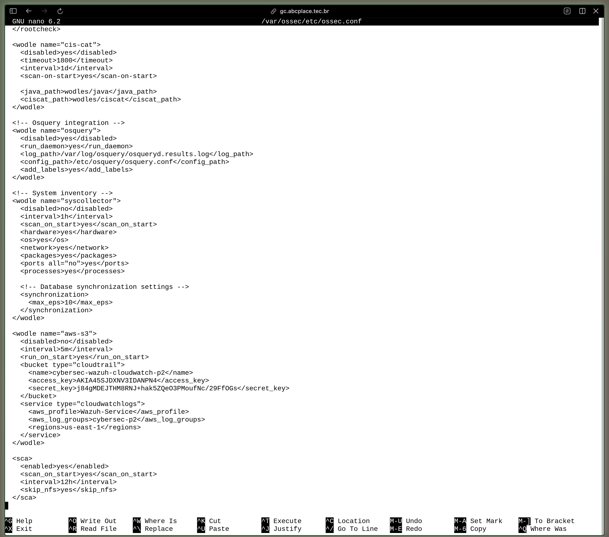

Contudo não conseguiu-se descobrir uma forma eficaz de testar o gerenciamente e posterior tratamento dos logs capturados. Pretendemos realizar tal tarefa no próximo roteiro.

## Fontes

- [IBM](https://www.ibm.com/br-pt/topics/siem#:~:text=O%20gerenciamento%20de%20informa%C3%A7%C3%B5es%20e,de%20interromper%20as%20opera%C3%A7%C3%B5es%20comerciais.)

- [NewRelic](https://newrelic.com/pt/blog/how-to-relic/what-is-log-management#:~:text=Os%20logs%20s%C3%A3o%20um%20registro,uma%20parte%20essencial%20da%20observabilidade.)

- [SolarWinds](https://www.solarwinds.com/resources/it-glossary/syslog-server-siem)

- [OSSEC-Hids](https://github.com/ossec/ossec-hids)

- [Wazuh](https://www.linkedin.com/pulse/wazuh-sabe-o-que-%C3%A9-para-serve-funcionalidade-se-liga-felipe-amaral/?originalSubdomain=pt)

- [Wazuh Documentação](https://documentation.wazuh.com/current/index.html)