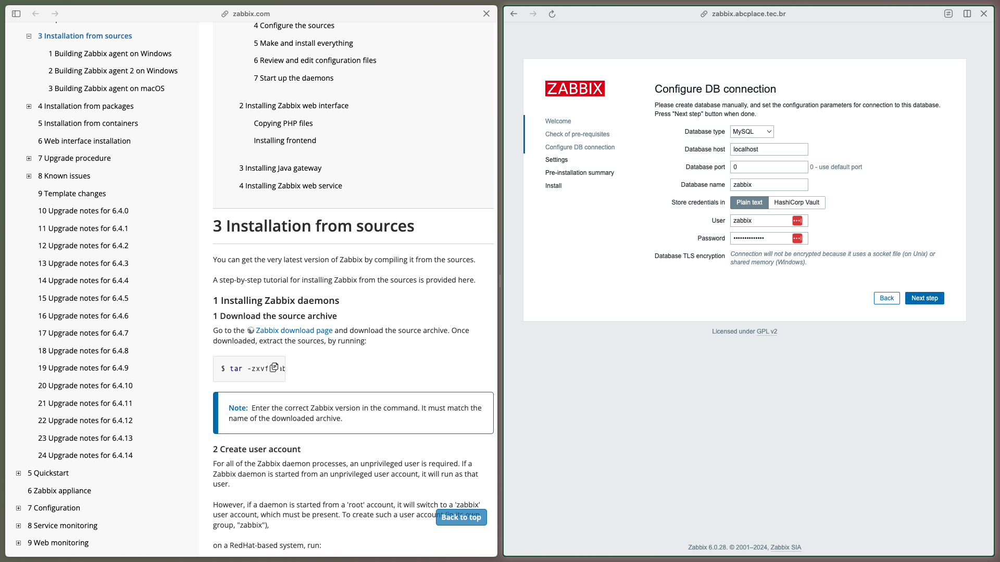
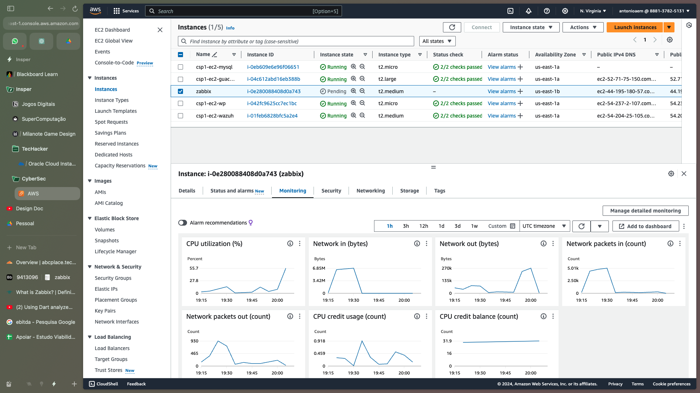
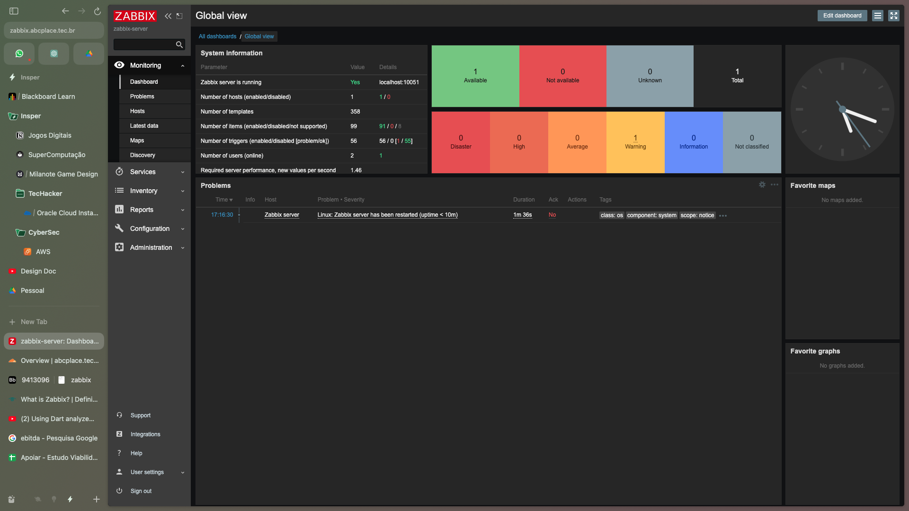
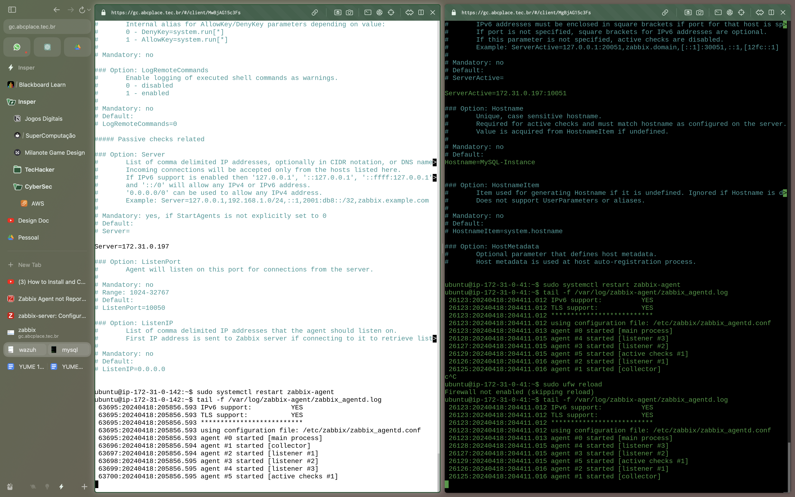
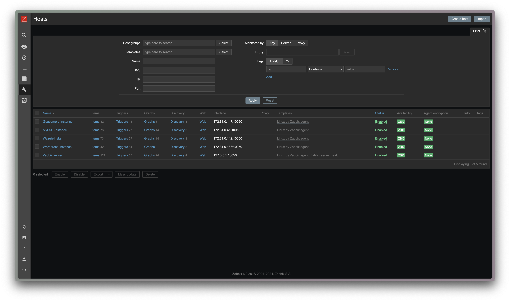

# Roteiro 3 - Operação e Gerenciamento
## Cyber Segurança em Nuvem 2024.1
### Grupo: Antônio Martins, Ariel Leventhal e Enricco Gemha

### 1. Introdução

O Zabbix é uma ferramenta `OpenSource` de monitoramento de infraestrutura que permite o monitoramento de diversos tipos de dispositivos, entre eles servidores, identificando o uso de CPU, memória, disco, entre outros parametros. O Zabbix é uma ferramenta muito utilizada por empresas devido a sua facilidade de uso e configuração, além de ser uma ferramenta gratuita.

### 2. Instalação

#### 2.1 Instalação do Zabbix Server

Para a instalaçnao do Zabbix Server foram utilizados os comandos disponibilizados no roteiro desta atividade, com algumas alterações de sintaxe.

```bash
sudo dpkg -i zabbix-release_6.0-4+ubuntu22.04_all.deb
sudo apt update
sudo apt install zabbix-server-mysql zabbix-frontend-php zabbix-apache-conf zabbix-sql-scripts zabbix-agent
```

Após a instalação foi criado um novo banco de dados MySQL para o Zabbix. E foi iniciado o serviço do Zabbix Server.

```bash
systemctl restart zabbix-server zabbix-agent apache2
systemctl enable zabbix-server zabbix-agent apache2
```

##### 2.1.2 Configuração do Zabbix

Com o Zabbix server instalado há a necessidade de acessar o frontend do Zabbix para finalizar sua configuração:



Após a configuração do banco de dados e a senha do usuário zabbix, há necessidade de se alterar o Name Server


Com isso o Zabbix Server inicia a configuração automática de seu ambiente.

Neste momento o grupo percebeu que a CPU da instância T2.micro não aguentou a instalação do Zabbix Server, atingiu 100% de uso e travou. Com isso o serviço foi iniciado novamente em uma nova instância T2.medium.





#### 2.2 Instalação do Zabbix Agent

Com o Zabbix Server instalado, há a necessidade de conectar todas as instância da rede privada utilizando o Zabbix Agent. Para isso foram utilizados os seguintes comandos, em cada uma das instâncias:

```bash
sudo wget http://repo.zabbix.com/zabbix/3.0/ubuntu/pool/main/z/zabbix-release/zabbix-release_3.0-2+bionic_all.deb
sudo apt update
sudo apt-get install zabbix-agent
sudo ufw allow 10050/tcp
```

Após a instalação do Zabbix Agent, é necessário configurar o arquivo de configuração do Zabbix Agent, localizado em `/etc/zabbix/zabbix_agentd.conf`. Neste arquivo é necessário alterar o `Server` e `ServerActive` para o IP do Zabbix Server, e o `Hostname` para o nome da instância.

```bash
Server=172.31.0.197
ServerActive=172.31.0.197:10051
```

Após a configuração do arquivo de configuração do Zabbix Agent, é necessário reiniciar o serviço do Zabbix Agent.

```bash
sudo service zabbix-agent restart
```

Caso o service não esteja `enabled` é necessário habilitar o serviço.

```bash
sudo systemctl enable zabbix-agent
```

Para checar se o Zabbix Agent está em funcionamento é necessário acessar o seguinte LOG:

```bash
tail -f /var/log/zabbix/zabbix_agentd.log
```



#### 2.3 Configuração das Instâncias no Zabbix Dashboard



Com isso todas as instâncias estão conectadas ao Zabbix Server e estão sendo monitoradas.

### 3. Perguntas

#### 3.1 O gerenciamento do ambiente Zabbix será realizado por meio de um agente instalado nos servidores. Qual a diferença do gerenciamento por agente e pelo protocolo SNMP?

Normalmente o Agente Zabbix ou Zabbix Agent é utilizado para monitorar servidores e computadores que tenham a capacidade de instalar o agente, havendo a necessidade de utilizarem sistema operacional compatível com o agente, e terem interfaces de rede que permitam a comunicação nas portas necessárias (10050 e 10051). Para dispositivos que não detenham estes pré requisitos é possível utilizar o protocolo SNMP, que possibilitará a coleta de informações sobre o dispositivo.

Caso fosse utilizado neste roteiro o SNMP ao invés do Zabbix Agent, haveria apenas a necessidade de se configurar o SNMP em todas as instâncias seguindo a documentação do Zabbix (https://www.zabbix.com/documentation/current/pt/manual/config/items/itemtypes/snmp). Porém em situações que hajam dispositivos não compatíveis como Switchs, roteadores, impressoras, seria necessária a configuração de ambos os serviços.

#### 3.2 O que é um NOC?

O Network Operations Center (NOC) é um local de monitoramento, gerenciamento e controle de uma rede de computadores, sendo responsável por possibilitar o funcionamento de uma rede de forma eficiente e segura. Em muitas empresas este centro de operações é responsável por monitorar a rede 24 horas por dia, tendo um sistema de monitoramento híbrido, que utiliza tanto computadores, sistemas de alertas, inteligência artificial e pessoas para monitorar a rede.

Uma vez que o NOC detecta um problema na rede, ele é responsável por identificar a causa do problema e corrigi-lo, ou então encaminhar o problema para a equipe responsável pela correção.

#### 3.3 O que é uma MIB?

O Management Information Base (MIB) é um banco de dados que têm como objetivo armazenar dados de entidades em uma rede de computadores. A MIB é utilizada para armazenar informações de dispositivos de rede, como servidores, mantendo informações sobre o status de cada dispositivo, uso de CPU, memória, disco, entre outras informações relacionadas a capacidade e performance dos dispositivos.

#### Como funciona o protocolo SNMP?

O Simple Network Management Protocol (SNMP) é um protocopo utilizado para o gerenciamento de dispositivos de rede, sejam eles roteadores, computadores, servidores, entre outros que estejam conectados a rede e suportem o protocolo. Este protocopo funciona na camada de aplicação, do modelo OSI, e é utilizado para monitorar e gerenciar dispositivos de rede.