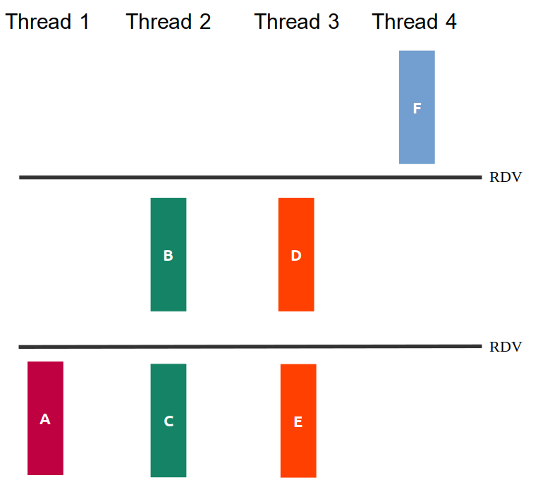

<!-- markdown_py README.md > README.html -->

# Prova Final - Sistemas Hardware-Software

Neste prova iremos avaliar os objetivos de aprendizagem trabalhados na segunda metade do curso. Cada pasta contém os arquivos de uma questão da prova, incluindo arquivos `.c` para vocês colocarem suas soluções.

## Regras da prova
1. A prova é individual. São permitidas consultas a todos os materiais de aula, incluindo suas soluções a exercícios de aula e labs. 
1. Não é permitido consultar outras pessoas, sejam do Insper ou não, durante a prova.
1. Esta prova também avalia fluência nos conceitos estudados.
1. A prova terá duração de `três horas`, com início às **13:30** e término às **16:30**. Desconsidere o tempo do proctorio.
1. A entrega da sua prova deverá ser feita via Blackboard. **Não serão aceitas entregas por outros meios**.
1. O item de entrega permite múltiplas tentativas. Sempre que terminar uma questão faça uma entrega completa. Isto visa minimizar problemas com entregas atrasadas.
1. Sua entrega consiste na pasta da prova inteira. Rezipe e entregue via Blackboard.
1. A chamada na prova será pela inicialização do proctorio e assinatura. Não saia sem assinar a lista.
1. Cada questão possui um arquivo específico para resposta. Não altere o nome destes arquivos.
1. Não serão tiradas dúvidas do conteúdo durante a prova.


## Questão 1 (2,5)

A figura *q1/sincronizacao.png* ilustra as relações de dependência entre as partes das funções `thread1`, `thread2`, `thread3` e `thread4`, mostrando que algumas delas poderiam ser feitas de maneira concorrente.



Seu trabalho nesta questão será:

**1.** criar threads para execução concorrente das funções (**40% da nota**)

**2.** usar semáforos para que a ordem dos prints das partes das tarefas respeitem o diagrama da figura (**60% da nota**)

**OBS**:

- Você não deve introduzir novas dependências. Ou seja, se seu programa criar relações de dependência além das da figura, sua questão poderá não receber nota.

- Não altere os `printf` existentes, nem adicione novos.


## Questão 2 (2,5)

Neste exercício, o programa `q2` recebe como argumento da linha de comando **uma palavra** e sua tarefa é fazer uma verificação da mesma.

Exemplo de como seu programa `q2` será chamado:

```
./q2 quadrado
```

Uma tarefa comum em programação de sistemas é **integrar com outros programas** instalados. Assim sendo, a palavra (no exemplo é **quadrado**) deverá ser examinada pelo programa `verify`, disponível de forma compilada para x86 na pasta da questão.

O programa `verify` retorna `-1` quando recebe uma chamada errada (quantidade de argumetos diferente de `1`), e valores de `0` a `4` inclusive. Você não precisa se preocupar com o significado de cada código retornado, apenas considere que a validação deve ser feita pelo verify e algum código deve ser retornado!

Entretanto, um problema é que as vezes as chamadas ao programa `verify` são interrompidas devido a sinais recebidos. Assim, você deve trabalhar no arquivo `q2.c` para:

- Criar um processo filho e nele, executar o `verify`, passando para o `verify` o primeiro argumento recebido pelo executável `q2` (**30% da nota**).
- No proceso pai:
    - Caso o processo filho TENHA finalizado normalmente, exiba a mensagem `VERIFY RETORNOU %d\n`, substituindo `%d` pelo retorno do `verify`. O processo pai deve sair retornando o mesmo valor devolvido por `verify` (**30% da nota**).
    - Caso o processo filho TENHA SIDO sinalizado, exiba a mensagem `VERIFY TEMINOU COM SINAL %s\n`, substituindo `%s` pelo texto que descreve o sinal.
    - Repita a chamada do `verify` (primeiro passo) até que ele finalize normalmente (**40% da nota**).

**Atenção**:

- O executável `verify` também tem a chamada no padrão `./verify palavra`

- Imprima EXATAMENTE conforme solicitado, sem deixar espaços antes ou depois das frases. Dê apenas um `\n` ao final.

**OBS**:

- Trabalhe no arquivo `q2.c` e complete as partes faltantes

- Compile com `gcc q2.c -o q2`

- Deixei um arquivo executável `q2_ref` que exemplifica o comportamento desejado do programa final (é um gabarito!). Teste, por exemplo, com `./q2_ref ferias` e utilize como referência!

- O executável `verify` tem comportamento aleatório, então as vezes irá demorar mais para conseguir validar a palavra

**Nesta questão você deverá usar as funções de gerenciamento de processos e chamada de executáveis vistas em aula. Você não pode, por exemplo, usar `system`.**


## Questão 3 (2,5)

Abra o arquivo `q3.c`!

Uma nova funcionalidade foi requisitada nesta aplicação e você é o responsável por implementá-la: gerar log de inicialização e finalização do programa, de modo que quando o usuário desejar fechar a aplicação, isto seja registrado em um arquivo de texto.

Sua tarefa neste exercício é:

- Na `main`, exibir com `printf` o PID do processo (**10% da nota**)

- Ao inicializar a aplicação com `./q3 logfile.log`, adicionar ao arquivo de log `logfile.log` uma nova linha contendo uma mensagem conforme o exemplo `08:15:03 ./q3 started\n`. Perceba que você deve incluir a hora, minutos e segundos do evento! Se o arquivo de log não existir, deve ser criado (**30% da nota**)

- Ao receber um sinal **SIGTERM**, adicionar ao arquivo de log uma nova linha contendo uma mensagem conforme o exemplo `08:15:03 ./q3 finished\n` (**35% da nota pelo registro do handler e pela mensagem no arquivo**)

- Ao receber um sinal **SIGINT**, exibir a mensagem na saída padrão e continuar normalmente (sem finalizar a aplicação): `Esta aplicacao nao fecha com SIGINT!\n` (**15% da nota pelo registro do handler e pela mensagem na saída padrão**)

- Se o arquivo de log já existir, ele não deve ser sobrescrito. As mensagens de log são concatenadas ao seu final (**10% da nota**)

**OBS**:

- Você deve criar as funções para serem handlers dos sinais

- Os Handlers devem ser registrados na `main`

- Perceba que o nome do arquivo de log é passado pela linha de comando, nem sempre será `logfile.log`.

- Para os arquivos, utilize APENAS as chamadas vistas em aula: `open`, `close`, `read`, `write`. Não pode utilizar `fopen` por exemplo

- Considere sempre a hora atual do sistema. Para trabalhar com as horas, consulte o manual: 
    - `man 3 time`
    - `man 3 localtime`
    - Veja o arquivo `q3_ref_horas.c`!

- Para testar, envie sinais pelo terminal e confira o arquivo de log gerado!


## Questão 4 (2,5)

No lab de processos vimos o quão necessário é saber manipular **strings** em **C**.

Neste exercício seu trabalho será criar uma função

```
char *extrair_arquivo(char *url)
```

que analisa a string `url` e retorna um ponteiro para **UMA NOVA string**, alocada **dinamicamente** contendo:

- O nome do arquivo apontado pela URL.

Exemplos:

- Para a entrada **http://www.google.com/icon.png** você deve retornar um `char*` contendo **icon.png**

- Para a entrada **ftp://receita.fazenda.gov.br/ir/2022/report1.pdf** você deve retornar um `char*` contendo **report1.pdf**

Abra o arquivo `q4.c`, analise os testes e implemente a função acima. Sua nota será pela porcentagem de testes aprovados, considerando um total de quatro testes.

Para compilar:

```
gcc -Og -g q4.o extrair.c -o q4
```

Para rodar os testes automáticos:

```
./q4
```

**OBS**:

- Você não pode nenhuma função da `string.h`. Ex: strlen, strcpy, strrchr, etc. Se utilizar, a questão será zerada.

- Precisa funcionar para qualquer URL, se tiver testes fixos apenas para burlar os testes, irá zerar!