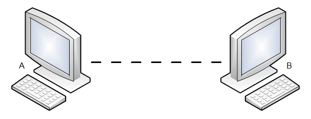

# Physical Layer of Computing (TeleCommunications)



This repository contains all the projects developed individually by Enricco Gemha, during the course of Physical Layer of Computing (2022/2), in the Computer Engineering program at [Insper](https://www.insper.edu.br/en/home).

*DISCLAIMER: Each project has its own instructions and studying material.*

Don't forget to install and activate the python ```venv```.

If you have any questions about the projects, send an email to: ```me@enriccogemha.dev```
